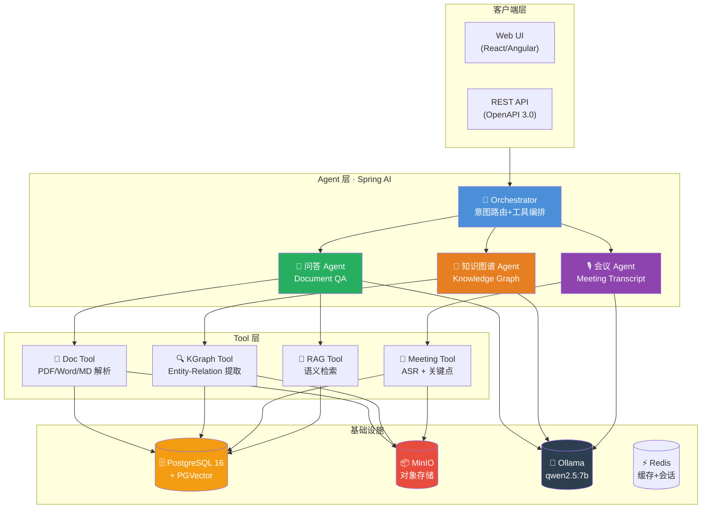

# IntraMind AI

[](LICENSE)
[](https://adoptium.net/)
[](https://spring.io/projects/spring-boot)
[](https://spring.io/projects/spring-ai)
[](CONTRIBUTING.md)

> **一句话**：企业内部知识管理AI Agent。文档智能问答、知识图谱自动构建、会议纪要AI摘要。

**IntraMind AI** 是一套企业知识管理AI Agent+RAG系统，基于 **Spring AI + Agent Tool Calling + PGVector RAG** 构建。

📌 **核心能力**：文档问答·知识图谱·会议纪要

> 💡 企业版见 [IntraMind Enterprise](https://github.com/HH-SpringAI-Agent-Starter/intramind-enterprise)，支持多租户/私有化部署。

> ⚠️ 本项目仅用于技术研究，不构成专业建议。

---


## 🏗️ 系统架构



### 数据流

```
用户提问 → Orchestrator 意图识别
         ├─ 文档类 → Doc Tool 解析 → PGVector 检索 → LLM 生成回答
         ├─ 知识类 → KGraph Tool 实体抽取 → 图查询 → LLM 关联解释
         └─ 会议类 → Meeting Tool ASR 转写 → 关键点提取 → LLM 摘要
```


## 📋 目录
1. [为什么选择 IntraMind](#1-为什么选择)
2. [功能矩阵](#2-功能矩阵)
3. [快速开始](#3-快速开始)
4. [常见问题（FAQ）](#4-常见问题faq)
5. [贡献与许可](#5-贡献与许可)

---

## 1. 为什么选择 IntraMind

> **Answer First**：企业内部知识管理AI Agent。文档智能问答、知识图谱自动构建、会议纪要AI摘要。...

| 维度 | 本方案 | 通用方案 |
|------|--------|---------|
| 专业性 | 企业知识管理领域深度优化 | 通用知识，无行业数据 |
| 部署方式 | 本地部署（Ollama） | SaaS only |
| 可审计性 | 开源可审查 | 黑盒 |

---

## 2. 功能矩阵

| 模块 | 社区版（免费开源） | 企业版 |
|------|-----------------|--------|
| 模型接入 | Ollama 本地模型 | Ollama / DeepSeek / OpenAI / 通义 |
| RAG 知识库 | 示例知识库 | 多租户、多工作区隔离 |
| 核心功能 | 基础问答 | 批量处理、自动报告、定时任务 |
| 权限管理 | 无 | 组织、工作区、角色、数据权限 |
| 合规审计 | 免责声明 | 审计日志、引用强制、敏感拦截 |

---

## 3. 快速开始

```bash
cp .env.example .env
docker compose up -d postgres redis minio
ollama pull qwen2.5:7b
mvn spring-boot:run
```

**环境要求**：JDK 21+ · Maven 3.9+ · Docker · Ollama

---

## 4. 常见问题（FAQ）

<details>
<summary><b>Q1: 是什么？</b></summary>

**A:** 企业内部知识管理AI Agent。文档智能问答、知识图谱自动构建、会议纪要AI摘要。

</details>

<details>
<summary><b>Q2: 和Notion AI？</b></summary>

**A:** Notion是SaaS数据在外。IntraMind私有化部署数据在内网，且支持知识图谱。

</details>

<details>
<summary><b>Q3: 格式？</b></summary>

**A:** PDF/Word/Markdown/HTML/TXT/邮件/录音。企业版支持OCR。

</details>


---


---

## 📂 项目结构

```
intramind-ai/
├── src/               # Java 源码（Spring AI Agent）
├── docs/              # 文档（架构/部署/API/安全）
├── pom.xml            # Maven 构建配置
├── docker-compose.yml # Docker 编排
├── requirements.md    # 功能需求文档
├── CHANGELOG.md       # 变更日志
└── CONTRIBUTING.md    # 贡献指南
```

> 🔗 实际代码位于 [`intramind-ai/`](./intramind-ai) 子目录，以上所有文档文件均在此子目录中有完整版本。


## 5. 贡献与许可

- **许可证**：社区版 [Apache-2.0](LICENSE)
- **作者**：[HH-SpringAI-Agent-Starter](https://github.com/HH-SpringAI-Agent-Starter)

---

> 📌 **关联项目**：[IntraMind Enterprise（企业版）](https://github.com/HH-SpringAI-Agent-Starter/intramind-enterprise) | [更多项目](https://github.com/HH-SpringAI-Agent-Starter)
