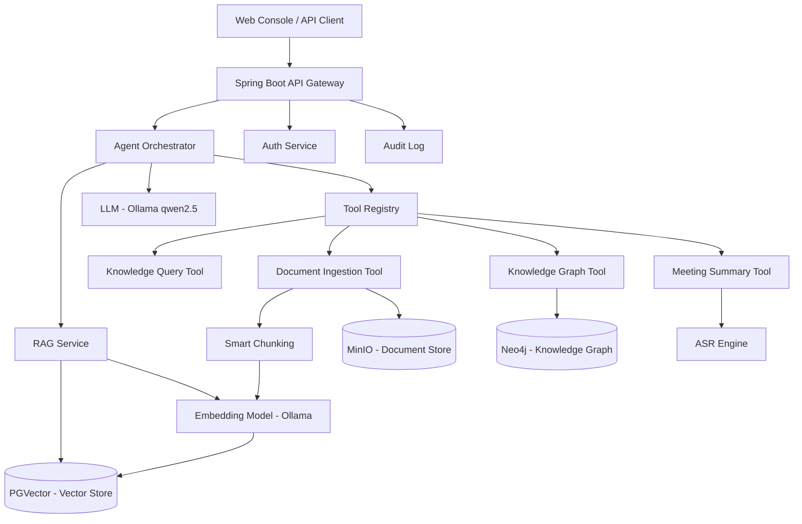

# IntraMind AI — 功能需求与架构设计

> 企业内部知识管理 AI Agent · 基于 Spring AI + RAG + 知识图谱

---

## 1. 项目概述

**IntraMind AI** 是一套企业级知识管理 AI Agent 系统，核心解决以下问题：
- 企业文档海量但检索低效，员工找不到需要的信息
- 会议纪要人工整理耗时且遗漏关键决策
- 跨部门知识孤岛，经验无法沉淀复用

**目标用户**：中型及以上企业（100+ 员工），拥有大量内部文档、会议记录需要管理。

---

## 2. 功能需求

### 2.1 文档智能问答（核心）

| 需求编号 | 功能 | 优先级 | 描述 |
|---------|------|--------|------|
| FR-001 | 多格式文档上传 | P0 | 支持 PDF / Word / Markdown / HTML / TXT / 邮件 EML / 录音转写 |
| FR-002 | 文档自动分块 | P0 | 智能分块策略：按段落+语义边界，块大小 512-1024 tokens，重叠 10% |
| FR-003 | 向量化存储 | P0 | 通过 EmbeddingModel 将文档块转为向量，存入 PGVector |
| FR-004 | 语义检索 | P0 | 基于用户问题检索最相关 Top-K 文档片段，支持混合检索（向量+关键词） |
| FR-005 | 引用溯源 | P1 | RAG 回答必须附带来源文档名+段落编号，点击可跳转原文 |
| FR-006 | 多轮对话 | P1 | 保持会话上下文，支持追问和澄清 |
| FR-007 | 权限感知检索 | P2 | 仅检索用户有权访问的文档范围（企业版） |

### 2.2 知识图谱自动构建

| 需求编号 | 功能 | 优先级 | 描述 |
|---------|------|--------|------|
| FR-101 | 实体抽取 | P1 | 从文档中自动抽取人名、部门、项目、产品、日期等实体 |
| FR-102 | 关系构建 | P1 | 识别实体间关系（汇报、参与、依赖、产自等） |
| FR-103 | 图谱查询 | P2 | 支持 Cypher-like 图查询：谁参与过XX项目、XX产品的负责人是谁 |
| FR-104 | 图谱可视化 | P2 | Web 端以力导向图展示知识图谱（企业版） |

### 2.3 会议纪要 AI 摘要

| 需求编号 | 功能 | 优先级 | 描述 |
|---------|------|--------|------|
| FR-201 | 录音转写 | P1 | 接入 ASR 引擎，将会议录音转文字 |
| FR-202 | 说话人识别 | P2 | 区分不同发言人，生成带发言人的逐字稿 |
| FR-203 | 智能摘要 | P1 | 自动生成：会议主题、讨论要点、决策事项、待办任务（含责任人+截止日期） |
| FR-204 | 一键分发 | P2 | 摘要生成后自动发送给参会人+抄送相关方（企业版） |

### 2.4 系统管理

| 需求编号 | 功能 | 优先级 | 描述 |
|---------|------|--------|------|
| FR-301 | 工作区管理 | P2 | 多工作区隔离（按部门/项目），各自独立的文档库和图谱 |
| FR-302 | 用户与角色 | P2 | RBAC 权限模型：管理员/编辑/只读（企业版） |
| FR-303 | 审计日志 | P2 | 记录所有问答、文档访问、图谱查询操作（企业版） |
| FR-304 | 用量统计 | P3 | Token 消耗、文档存储量、API 调用次数仪表盘（企业版） |

---

## 3. 架构设计

### 3.1 系统架构图



### 3.2 数据流

```
文档上传 → 格式识别 → 智能分块 → 向量化 → PGVector 存储
                                           ↓
用户提问 → 意图识别 → 混合检索(Top-K) → 上下文拼接 → LLM 生成 → 带引用回答
                                           ↓
                             实体抽取 → 关系构建 → Neo4j 图谱
```

### 3.3 技术选型

| 层次 | 技术栈 | 说明 |
|------|--------|------|
| AI 框架 | Spring AI 1.0+ | Agent Tool Calling、Embedding、Chat |
| 后端框架 | Spring Boot 3.x / Java 21 | RESTful API |
| 向量数据库 | PGVector (pgvector 扩展) | 与业务数据库同库，降低运维成本 |
| 图数据库 | Neo4j Community | 知识图谱存储与查询 |
| 对象存储 | MinIO | 文档原始文件存储，S3 兼容 |
| 缓存 | Redis | 会话缓存、检索结果缓存 |
| 本地模型 | Ollama + qwen2.5:7b | 默认模型，可切换 |
| 容器化 | Docker Compose | 一键部署全部依赖 |
| 构建工具 | Maven 3.9+ | 依赖管理与构建 |

### 3.4 模块划分

```
intramind-ai/
├── agent/           # Agent 编排与 Tool Calling
│   ├── orchestrator/  # 主控 Agent
│   └── tools/         # 工具注册与实现
├── rag/             # RAG 检索增强
│   ├── ingestion/     # 文档接入
│   ├── chunking/      # 智能分块
│   ├── embedding/     # 向量化
│   └── retrieval/     # 混合检索
├── knowledge/       # 知识图谱
│   ├── extraction/    # 实体关系抽取
│   └── graph/         # 图谱查询
├── meeting/         # 会议纪要
│   ├── asr/           # 语音转写
│   └── summary/       # 智能摘要
├── common/          # 公共模块
│   ├── config/        # 配置管理
│   └── security/      # 安全与审计
└── api/             # REST API 层
```

---

## 4. 非功能需求

| 需求 | 指标 | 说明 |
|------|------|------|
| NFR-001 | 问答延迟 | P95 < 3s（含 RAG 检索+LLM 生成） |
| NFR-002 | 文档处理吞吐 | 单文档 < 30s（10MB PDF） |
| NFR-003 | 并发支持 | 社区版 10 并发，企业版 100+ |
| NFR-004 | 数据安全 | 文档存储加密，传输 TLS 1.3 |
| NFR-005 | 可用性 | 单机部署可用性 99.5%，企业版 HA 99.9% |
| NFR-006 | 可扩展性 | 支持水平扩展 RAG 服务和 API 网关 |

---

## 5. 路线图

| 版本 | 里程碑 | 预计时间 |
|------|--------|----------|
| v1.0 | 基础 RAG 问答 + 文档接入 | ✅ 已完成 |
| v1.1 | 知识图谱 v1（实体+关系） | 2026-Q3 |
| v1.2 | 会议纪要 AI 摘要 | 2026-Q3 |
| v1.3 | 混合检索（向量+关键词） | 2026-Q4 |
| v2.0 | 企业版：多租户+RBAC+审计 | 2026-Q4 |
